# MedQueue GH — Backend (Django API)



This branch contains the **backend** for **MedQueue GH**, a cross-platform mobile application designed to modernize healthcare access at local hospitals in Ghana, starting with a pilot deployment at ...

## Team

- BAKYELLE DAVID (Lead)
- AMOANIMAA Bernice (Ms)
- OSIKA Kofi Ricky
- OFOSUHENE Jeffery Nana
- ASABAH Prince

## Repository Branches

- **Backend (this branch):** `main` — Django + Django REST Framework API
- **Frontend:** `master` — Flutter mobile application

> If you’re looking for the mobile app UI, switch to the `master` branch.

---

## What’s in this branch

- Django project and apps (API, models, admin)
- REST endpoints (Django REST Framework)
- Backend configuration and dependencies (`requirements.txt`)

---

## Tech Stack

- **Python**
- **Django**
- **Django REST Framework**
- Database: SQLite (dev) / PostgreSQL (recommended for production)

---

## Project Structure (Backend)

At the repository root (this branch), you should see:

- `manage.py` — Django entry point
- `medqueue_backend/` — Django settings / urls / wsgi-asgi
- `base/` — Django app(s) and backend modules (project-specific)
- `requirements.txt` — Python dependencies

---

## Getting Started (Backend)

### Prerequisites

- Python 3.10+
- pip
- Git

### Setup

```bash
# clone
git clone https://github.com/Bakyelle/MedQueue_GH.git
cd MedQueue_GH

# (important) switch to backend branch
git checkout main

# create + activate venv
python -m venv venv
# macOS/Linux
source venv/bin/activate
# Windows (PowerShell)
# .\venv\Scripts\Activate.ps1

# install deps
pip install -r requirements.txt

# run migrations
python manage.py migrate

# start server
python manage.py runserver
```

### Quick Demo

Use these steps to demonstrate the running app locally:

1. Start the backend:

```powershell
. .\.venv\Scripts\Activate.ps1
python manage.py runserver 127.0.0.1:8000
```

2. Open the Django admin at http://127.0.0.1:8000/admin/ and sign in with:
- Username: `admin`
- Password: `AdminPass123`

3. Test the patient flow with the seeded demo account:
- Login URL: http://127.0.0.1:8000/login/
- Username: `demo_patient`
- Password: `DemoPass123!`

4. Register a new patient by sending a POST request to http://127.0.0.1:8000/register/.
  The OTP is printed in the server terminal during development.

5. Verify the OTP with a POST request to http://127.0.0.1:8000/otp/verify/ to receive JWT tokens.

---

## Environment / Configuration

This backend will typically require secrets and environment variables (e.g., Django `SECRET_KEY`, database URL, third-party API keys).

**Do not commit secrets**. Use a `.env` file locally (or another secrets manager) and load it in `settings.py`.

If you share which variables you’re using (or where they’re defined), I can add an exact **Environment Variables** section.

---

## API Documentation

If you have an OpenAPI/Swagger schema, Postman collection, or DRF browsable API URLs, link them here.

Suggested sections to document:

- Auth (patients/doctors/admin)
- Doctors & schedules
- Appointments
- Queue updates
- Emergency SOS events

---

## Contributing

1. Create a feature branch off the correct branch (backend changes from `main`)
2. Commit your changes
3. Open a PR

---

## License

Add a license (and/or a `LICENSE` file) for the project.
